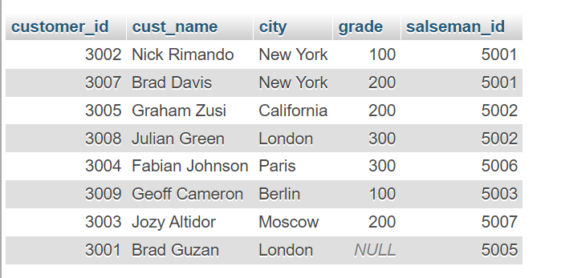
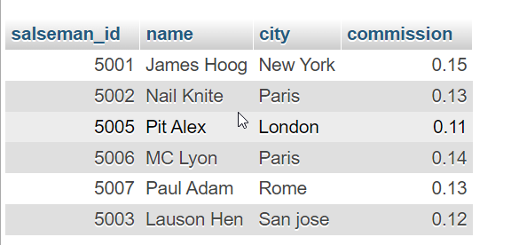
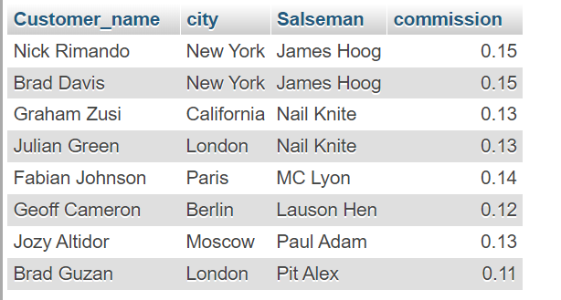

## Consider a database containing two tables named as Customer and Salesman

<hr>

## Customer :

```
CREATE TABLE customer(customer_id int, cust_name varchar(20), city varchar(20), grade int, salseman_id int);

INSERT INTO customer(customer_id, cust_name, city, grade, salseman_id)
VALUES(3002, 'Nick Rimando', 'New York', 100, 5001),
(3007, 'Brad Davis', 'New York', 200, 5001),
(3005, 'Graham Zusi', 'California', 200, 5002),
(3008, 'Julian Green', 'London', 300, 5002),
(3004, 'Fabian Johnson', 'Paris', 300, 5006),
(3009, 'Geoff Cameron', 'Berlin', 100, 5003),
(3003, 'Jozy Altidor', 'Moscow', 200, 5007),
(3001, 'Brad Guzan', 'London', null , 5005);

```

## Output Image



<hr>

## Salseman :

```
CREATE TABLE salseman(salseman_id int, name varchar(20), city varchar(20), commission float);

INSERT INTO salseman(salseman_id, name, city, commission)
VALUES(5001, 'James Hoog', 'New York', 0.15),
(5002, 'Nail Knite', 'Paris', 0.13),
(5005, 'Pit Alex', 'London', 0.11),
(5006, 'MC Lyon', 'Paris', 0.14),
(5007, 'Paul Adam', 'Rome', 0.13),
(5003, 'Lauson Hen', 'San jose', 0.12);

```

## Output Image



<hr>
From the above given tables write a SQL query to find the salesperson(s) and the
customer(s) represented here. Return the Customer Name, City, Salesman,
commission.
NOTE : Make sure you have to use join concept to solve the query
Make sure to make your code clean kneat
<hr>

```
SELECT c.cust_name AS 'Customer_name',
c.city,
s.name AS 'Salseman',
s.commission FROM
customer c
INNER JOIN salseman s ON c.salseman_id = s.salseman_id;
```

## Output Image


